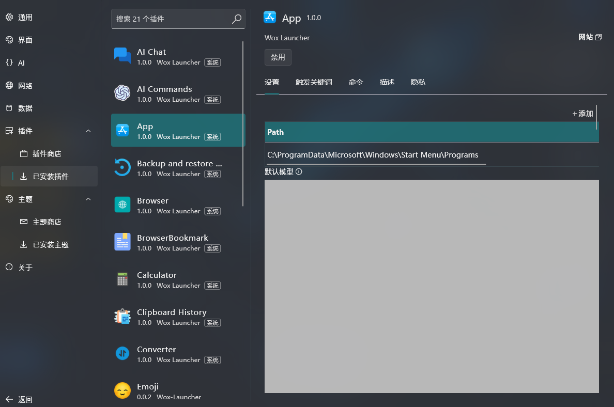
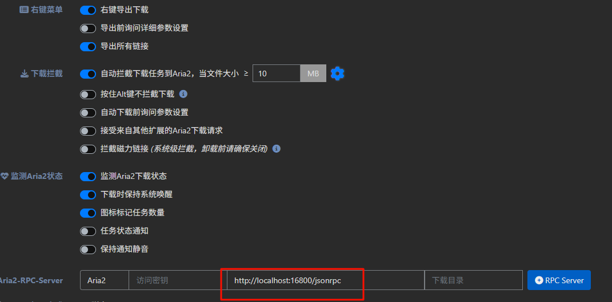
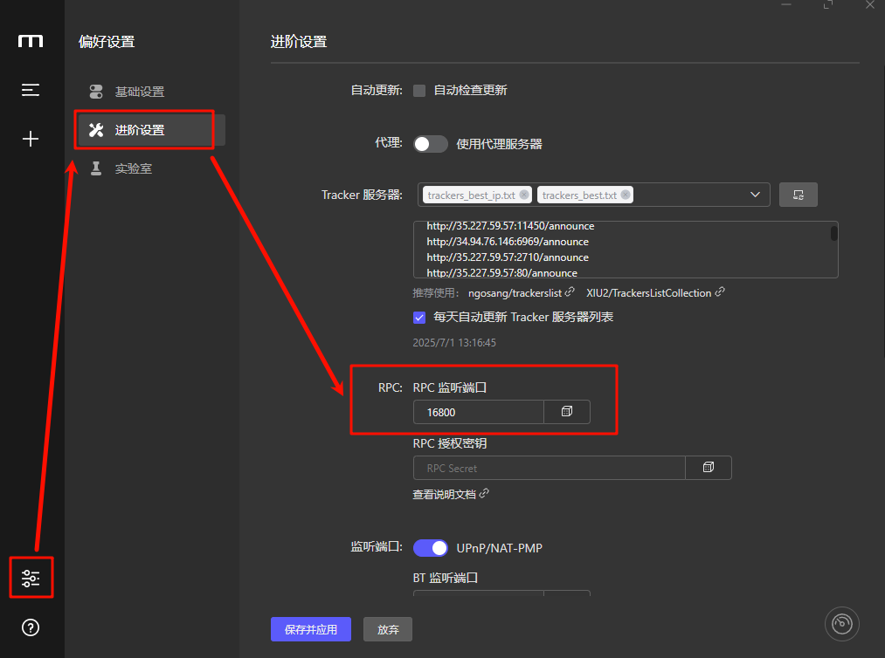

#  Efficiency Memo 01: My Efficiency Tools of Choice: Wox and imfile

## **Minimalist Open Source Launcher: Wox**

 Download link: https: [//github.com/Wox-launcher/Wox/releases](https://github.com/Wox-launcher/Wox/releases)

 Regarding the quick startup software, after I used listary, utools and other similar software, I finally chose the open source wox, I don't need extra so-called "extended functions", I just need simple and fast, and wox can solve my needs. If you are like me, and your core needs for a launcher are "fast" and "pure", then Wox is definitely for you.

 Especially after wox2, the software ui style is basically the same as the fluent design language of win11.

 In addition to quick launch applications, wox also built-in math calculation, web search and other high-frequency functions.

 Of course, if you want, you can directly call AI models for chatting (you need to set api manually).

 However, wox may not be able to search for software shortcuts in the start menu, so you need to add them manually in the app.

 However, the wox2 version can't use the plugin ecosystem of the old version, so if you rely heavily on the plugin market of the previous wox, please don't download the wox 2 version, but choose wox 1 instead, also please note!

## **All-in-one download tool: Motrix**

 Official website: https: [//motrix.app/](https://motrix.app/)

 When it comes to multithreaded download tools, IDM is the first one that comes to mind, or at least it was for me, because the speed of the download is one of its main advantages, and it automatically takes over the progress of my download when I download a file in my browser.

 However, I know that you may have been discouraged by the price of Idm or the payment model, but some time after that, a download tool called Motrix appeared in my vision, it also downloads fast, has a modern interface, supports HTTP, FTP, BitTorrent, Magnet and other protocols, open source is its biggest advantage, but I was annoyed by the fact that it could not take over the browser download. But the problem is that it can't take over the browser downloads, so I haven't used it.

 While surfing the web (why use such an archaic term) I discovered that Motrix can intercept browser downloads to Aria2 using the [Aria2 Explorer](https://chromewebstore.google.com/detail/aria2-explorer/mpkodccbngfoacfalldjimigbofkhgjn) plugin, and Motrix can receive the intercepted tasks, which has now completely replaced the IDM I was using.

## **Aria2 Explorer**

 Download link: https: [//chromewebstore.google.com/detail/aria2-explorer/mpkodccbngfoacfalldjimigbofkhgjn](https://chromewebstore.google.com/detail/aria2-explorer/mpkodccbngfoacfalldjimigbofkhgjn)

 By installing the **Aria2 Explorer** plugin, you can intercept downloads from your browser and send them directly to Motrix, with a simple setup of the RPC port, for a seamless download experience comparable to IDM.

 After downloading the Aria2 Explorer plugin, you can tweak it to my settings

 The xxx port number for [http://localhost:xxx/jsonrpc](http://localhost/:xxx/jsonrpc) is the Motrix RPC listener port, so make sure it's the same.

## **The successor to the all-in-one download tool: imfile**

 Download link: https: [//github.com/imfile-io/imfile-desktop](https://github.com/imfile-io/imfile-desktop)

 As good as Motrix is, it's been a long time since a new distribution was released, the last update was 2 years ago, so if you want to use a software that is continuously maintained and optimized (at least I prefer to use software that is continuously maintained)

 If you want to use a software that is continuously maintained and optimized (or at least I prefer to use continuously maintained software), then you can choose its offshoot imfile, which inherits the features of Motrix and continues to iterate on them, optimizing the interface, fixing bugs, and keeping it open source, which is what I've ended up using so far!

 At least at the time of writing, there is still a recent commit (2 weeks ago), so you can continue to use imfile as an alternative to Motrix!

