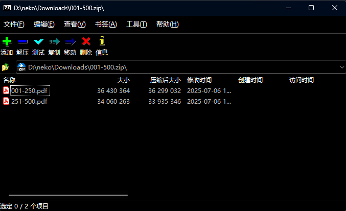
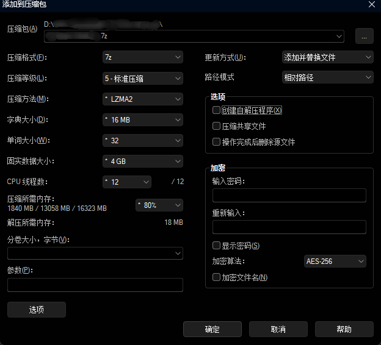
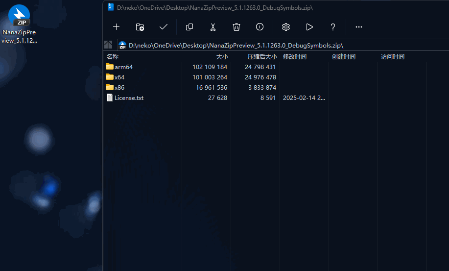
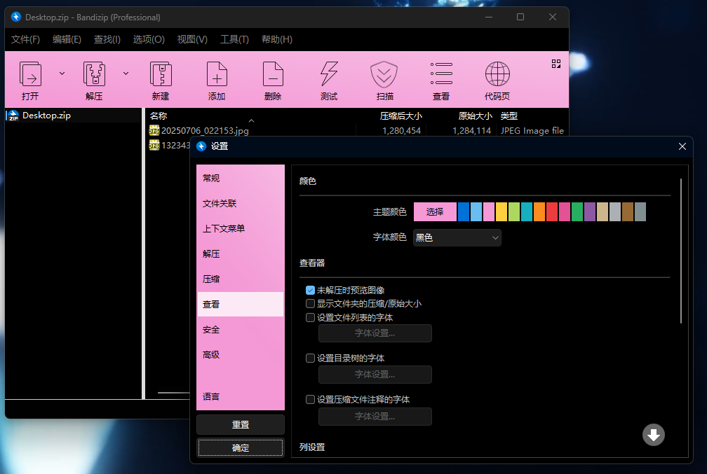
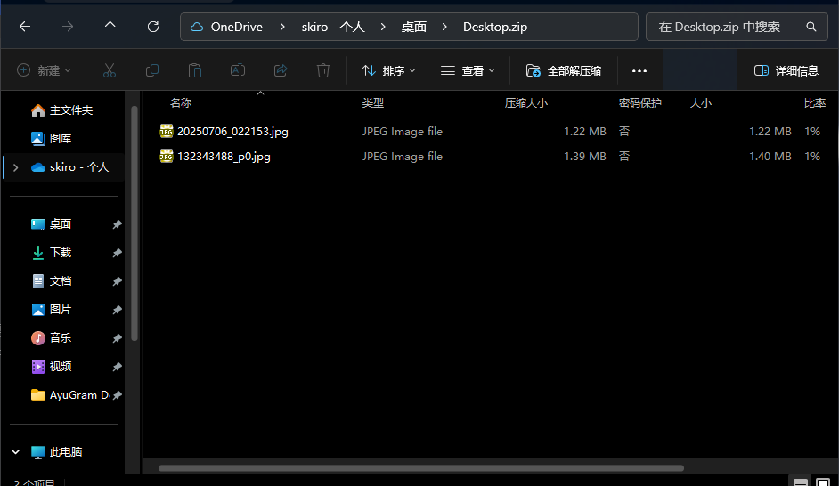

# **Efficiency Memo 02 Best Compression Software: 7-Zip, NanaZip and Bandizip**

## **7-Zip**

 Download: https: [//www.7-zip.org/](https://www.7-zip.org/)

 When it comes to decompression tools, 7-zip is probably the most recommended, small, open source and free, but perhaps its drawbacks are more obvious: a slightly outdated user interface, not modern enough (which may not be a drawback for some users who are looking for the ultimate in simplicity and performance).

 The software supports the opening of various compression formats and offers the ability to encrypt, split, or self-extract programs.

## **NanaZip**

 Download: https: [//github.com/M2Team/NanaZip](https://github.com/M2Team/NanaZip)

 Of course, perhaps you are not the part of the user who seeks simplicity, and do not like the interface of the 7-zip software, you hope that the interface can be more beautiful, then you can choose Nanazip, where nana (なな) is the Japanese word for seven!

 This is an open-source, 7zip kernel-based, but more modernized branch of 7zip that includes

- Full dark color mode
- Mica effects in the main window
- a more modernized software interface
- additional codecs and other features

 The program modifies the icons of various icons, and all the features of 7-zip are retained by nanazip.

 At the same time, nanazip has made some experience optimizations, for example, when you use 7zip, the whole directory is full of files, but when you switch to nanazip, the software **automatically creates a folder with the same name as the zip file**.

## **Bandizip**

 Apart from 7-zip, the most mentioned compression program is perhaps bandizip, which also supports several compression formats and offers more extensions to it.

 bandizip not only has the automatic folder creation feature of nanazip, but also provides additional buttons to locate the compressed and decompressed files when they are decompressed.

 In addition, it adds test files, virus scanning, and the ability to switch text encoding to solve the problem of garbled file names, which is especially useful in Japanese games (I don't have a garbled file at the moment, so I can't demonstrate it).

 In addition, bandizip comes with an image preview function, so you can preview the image directly on the side in real time.

 Or you can double-click on the file to preview the image and use the keyboard arrow keys to turn the page.

 Bandizip also has a color setting function (not useful, but it can be used for personalized needs, such as slammer pink XD).

 According to the official documentation, Bandizip provides a password manager starting from V7.0, which allows users to decompress/zip files using the password of the password manager.

 However, please also note that bandizip is not an open source software, the software is divided into free version and paid professional version, and the price is not cheap, so whether you need additional features, you need to make trade-offs depending on the situation, and if you have strict requirements for data security, please also make sure to use open source software.

 Free users can use it directly, but there may be advertisements.

 Functions included in the paid version: Remove ads Password manager Repair zip archive Preview images in zip archive Password recovery

## **password recovery**

 ........ You're not going to use Windows Explorer as a compression tool, are you? I don't think so.

 To get back to the point, the fact is that for light users, Windows Explorer's decompression tool can be used (if you want to use it).

 After win11 **23H2**, Windows Explorer has native support for TAR, 7Z, RAR formats, which is good for those who don't want to install third-party programs.

