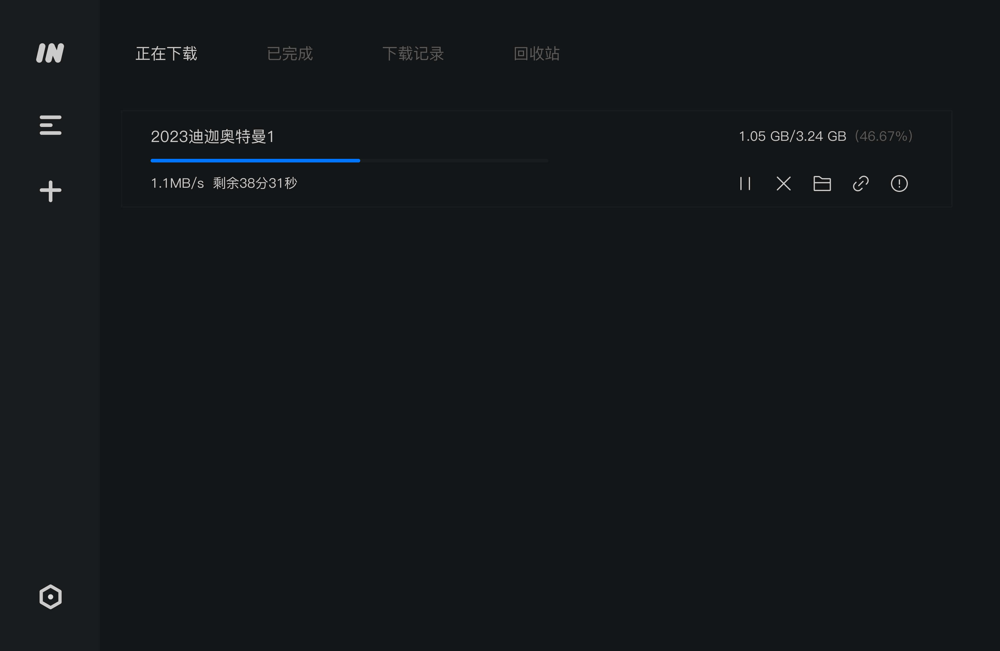

### **简约的开源启动器：Wox 2**

下载链接：[https://github.com/Wox-launcher/Wox/releases](https://github.com/Wox-launcher/Wox/releases)

关于快速启动类软件，在我使用过 listary，utools 等各种类似软件后，我最终还是选择了开源的 wox，我并不需要额外的所谓“扩展功能”，我只需要简洁，快速即可，而 wox 即可解决我的需求。如果你和我一样，对启动器的核心需求就是“快”和“纯粹”，那么 Wox 绝对能满足你。

尤其是在 wox2 后，软件 ui 风格和 win11 的 fluent design 设计语言基本一致。

除了快速启动应用，wox 也内置了数学计算、网页搜索等高频功能。

当然，如果你想可以直接调用AI模型进行聊天（需要手动设置 api

不过wox可能搜不到在开始菜单的软件快捷方式，需要在app中手动添加

不过 wox2 版本无法使用旧版本的插件生态，如果你非常依赖之前 wox 的插件市场，请不要下载 wox 2 版本，而是选择 wox 1，还请注意！

### **全能下载工具：Motrix**

官网：[https://motrix.app/](https://motrix.app/)

提到多线程下载工具，首当其冲想到的便是IDM，至少我之前便是，下载速度快是其一大的优势，并且当我在浏览器下载文件时会自动接管我的下载进度。

不过我知道各位可能由于 Idm 的价格或者付费模式望而却步，但是，在此之后的一段时间，一款名为 Motrix 的下载工具出现在了我的视野，它下载也很快，界面现代化，支持 HTTP, FTP, BitTorrent, Magnet 等多种协议，开源是其最大的优势，但苦恼于其不能接管浏览器下载，导致我一直未使用过它。

当我网上冲浪时（为什么要用这么古早的词汇）发现 Motrix 可以使用 [Aria2 Explorer](https://chromewebstore.google.com/detail/aria2-explorer/mpkodccbngfoacfalldjimigbofkhgjn) 插件拦截浏览器下载任务到 Aria2，而 Motrix 可以接收拦截到的任务，现在它已经完全替换掉我之前使用的 IDM 了。

### **Aria2 Explorer**

下载链接：[https://chromewebstore.google.com/detail/aria2-explorer/mpkodccbngfoacfalldjimigbofkhgjn](https://chromewebstore.google.com/detail/aria2-explorer/mpkodccbngfoacfalldjimigbofkhgjn)

通过安装 **Aria2 Explorer** 这个插件，你就可以拦截浏览器的下载任务，并将其直接发送给 Motrix。只需简单设置一下 RPC 端口，就能实现媲美 IDM 的无缝下载体验。

下载 Aria2 Explorer 插件后，你可以根据我的设置进行调整

其中的 [http://localhost:xxx/jsonrpc](http://localhost/:xxx/jsonrpc) 的 xxx 端口号为 Motrix  RPC 监听端口，请确保一致。

### **全能下载工具继任者：imfile**

下载链接：[https://github.com/imfile-io/imfile-desktop](https://github.com/imfile-io/imfile-desktop)

虽然 Motrix 很好，但很久没有发布过新的发行版了，上次更新还是2年前，如果你希望使用一款持续维护和优化的软件（至少我更喜欢用持续维护的软件）

那么你可以选择它的分支 imfile，它继承了 Motrix 的特性并以此为基础继续更新迭代，优化了软件界面，修复了各种bug，并且继续保持开源，而这也是我目前在用的最终选择

至少在我攥稿时该软件仍旧有最新的代码提交记录（2周前），各位可以将 imfile 作为 Motrix 替代性软件继续使用

