# **效率备忘录 02 最佳压缩软件：7-Zip, NanaZip 和 Bandizip**

## **7-Zip**

下载地址：[https://www.7-zip.org/](https://www.7-zip.org/)

说到解压缩工具，那么被首要推荐的或许就是 7-zip 了，体积小，开源免费，或许他的缺点更是显而易见： 稍显过时的用户界面，不够现代化（这对于部分追求极致简约和性能用户来说或许并不是缺点）

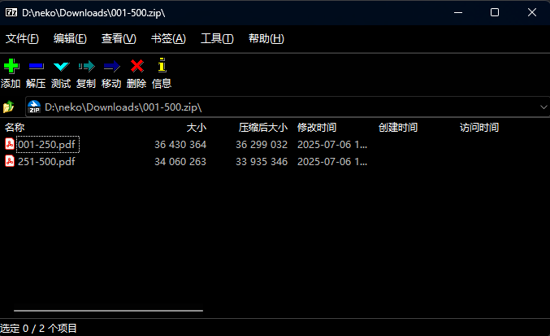

软件支持打开软件支持打开各种压缩格式，并提供了加密，分卷压缩，或者是自解压程序功能

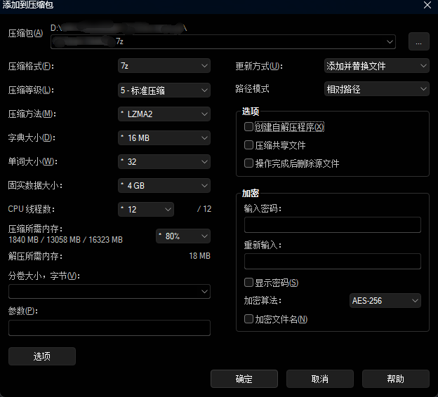

## **NanaZip**

下载地址：[https://github.com/M2Team/NanaZip](https://github.com/M2Team/NanaZip)

当然，或许你不是那部分追求简约的用户，并不喜欢 7-zip 的软件界面，你希望界面可以更加美观，那么你可以选择 Nanazip，其中 nana (なな) 是日语七的意思

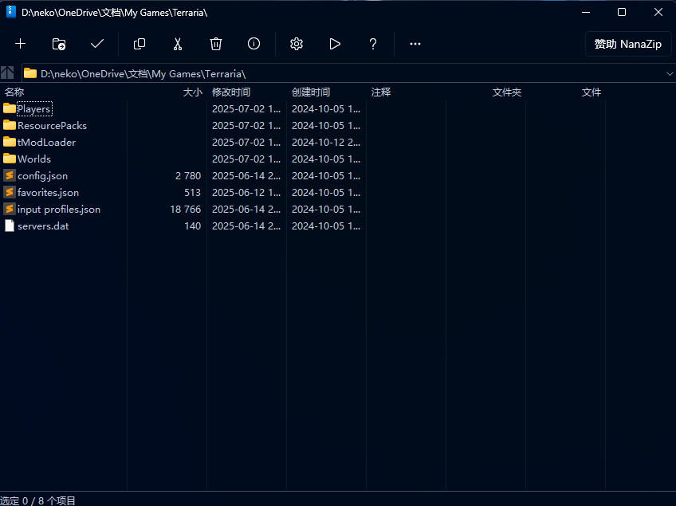

这是一款开源的，基于 7zip 内核的，但更注重现代化的 7zip 分支，包括

- 完整的深色模式
- 主窗口支持云母效果
- 更现代化的软件界面
- 额外的编解码器等功能

该软件对修改了各种 icon 的图标，另外 7-zip 所有功能 nanazip 均有所保留。

同时 nanazip 做了一些体验优化，例如当你使用 7zip 解压时，会解压的整个目录都是文件，而切换至 nanazip 后软件**默认会为你自动创建一个与压缩包同名的文件夹**

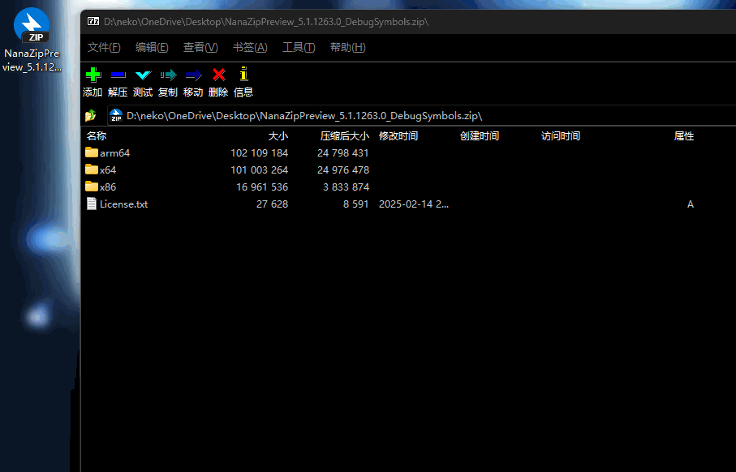

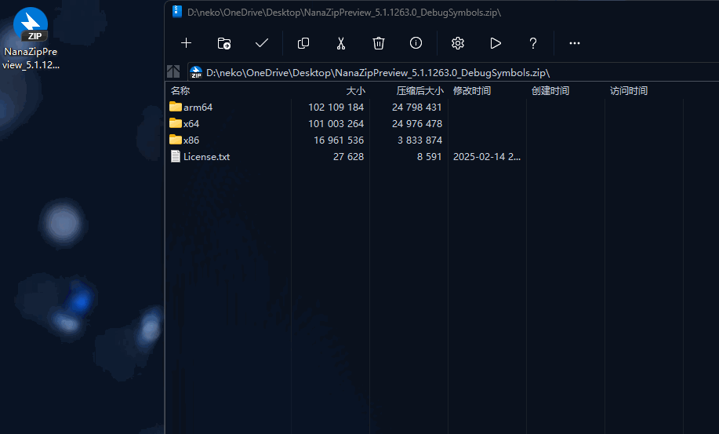

## **Bandizip**

除了 7-zip，压缩软件被提到最多的或许就是 bandizp 了，该软件同样支持了多种压缩格式，并为其提供了更多扩展功能

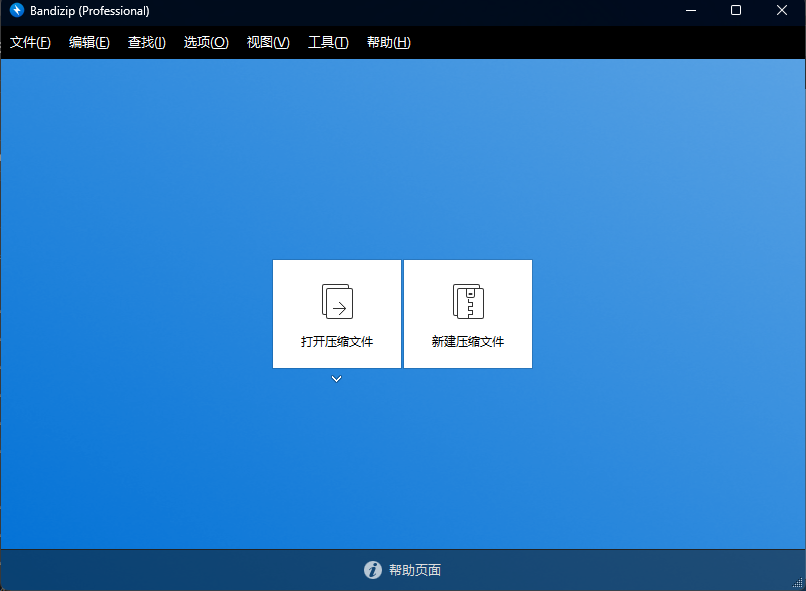

bandizip 不仅具有上述 nanazip 的解压自动创建文件夹的功能，另外当解压文件后提供了额外的按钮，能够定位到压缩文件，解压文件所在位置

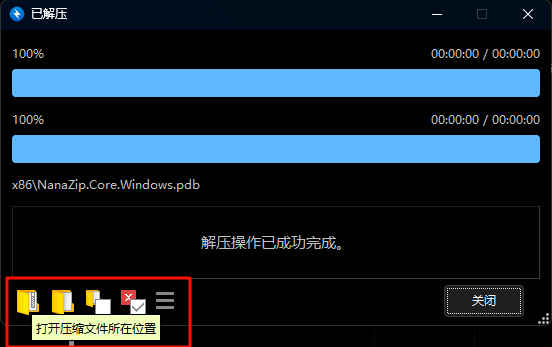

另外增加了测试文件，病毒扫描，以及一下切换文字编码，解决文件名的文字乱码的问题，这在日文游戏中尤其受用（我目前没有乱码文件，无法演示）

此外，bandizip 自带图片预览功能，可以直接在侧边实时预览图片

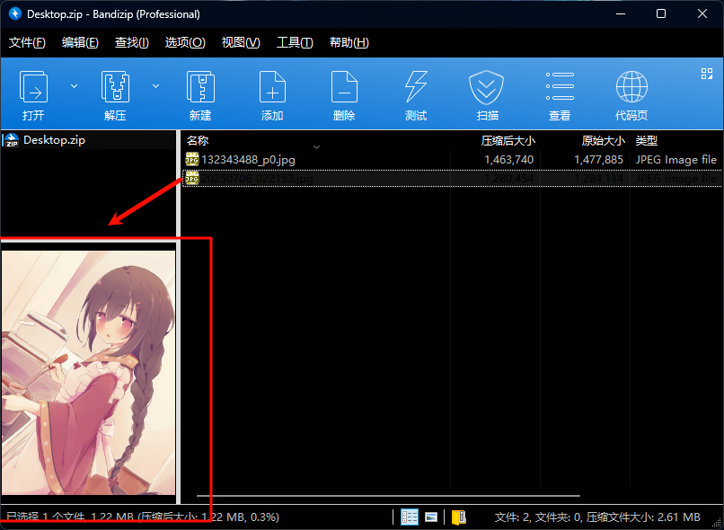

或者选择双击文件预览图片，使用键盘方向键翻页。

bandizip 还有一个设置颜色的功能（虽然没啥用，但能满足个性化需求，比如猛男粉 XD

根据官方文档，Bandizip 从 V7.0 开始提供一个密码管理器，允许用户使用密码管理器的密码进行解压/压缩

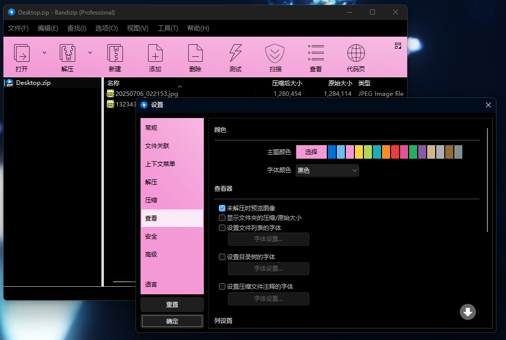

但还请注意，bandizip 并不是一个开源软件，该软件分为免费版和付费专业版，且价格也不算便宜，所以是否需要额外的功能，需要你视情况进行取舍，如果对数据安全有严格的要求，还请务必使用开源软件。

免费用户可以直接使用，但可能有广告

付费版包含的功能：去除广告 密码管理器 修复压缩包 压缩包内预览图片 密码恢复

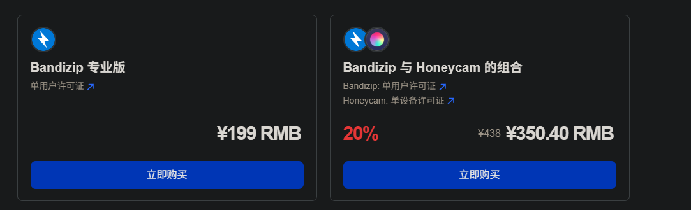

## **windows 资源管理器**

........你不会打算用windows 资源管理器当压缩工具吧？应该不会吧？

言归正传，事实上，对于轻度用户来说，windows 资源管理器的解压缩工具也可以用（如果你想用的话）

在 win11 **23H2** 之后的版本，Windows 资源管理器已经原生支持 TAR、7Z、RAR 格式的解压缩，对于不想安装第三方的用户可以说是利好了

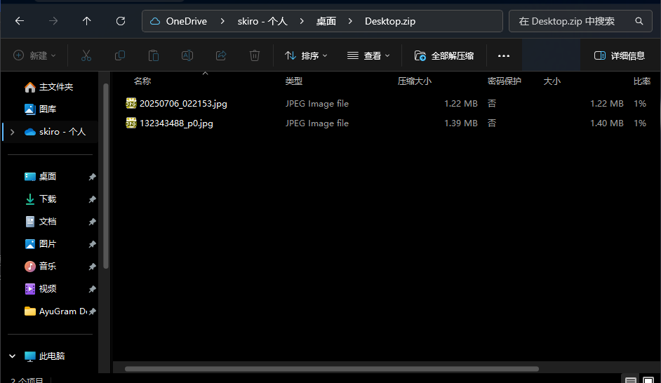
